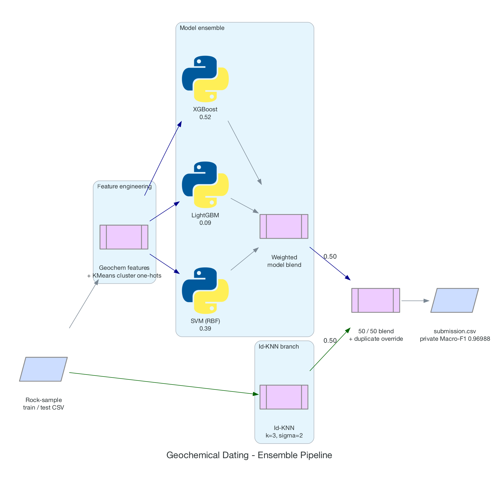

# Geochemical Dating — Runner-up (2nd of 31)

[](https://github.com/damsolanke/geochemical-dating/actions/workflows/ci.yml)

Runner-up — **2nd of 31 teams** — on the Kaggle *Geochemical Dating* competition: predicting the geological age class of igneous rock samples from their major-oxide and trace-element geochemistry. Final private-leaderboard **Macro-F1 = 0.96988**, **0.00104 behind 1st place** (0.97092).

<p align="center"></p>

## Result

The final submission was chosen on cross-validation rather than public-leaderboard rank. That bias toward generalisation proved correct: it ranked 2nd on the public board and moved **upward** to 0.96988 on the private split, while the public leader fell to 3rd.

| Competitor | Public LB | Private LB | Private rank |
|---|---|---|---|
| Raphael Stottele | 0.93876 | **0.97092** | **1st** |
| **This solution** | 0.96292 | **0.96988** | **2nd** |
| Nikita Shevyrev | 0.96649 | 0.95728 | 3rd |

The public-leaderboard leader (0.96649) dropped to 3rd on the private split (0.95728) — a textbook public→private shake-up — while this submission moved from 0.96292 to 0.96988. First place went to a low-public-profile entry (0.93876 public) whose pick generalised even better, finishing **0.00104** ahead. The takeaway cuts both ways: avoiding public-LB overfitting is necessary but not sufficient — the eventual winner was simply even less coupled to the public signal.

## Problem

| Field | Value |
|---|---|
| Task | 3-class classification — geological age of ultrabasic/igneous melt samples |
| Metric | Macro-F1 (all classes weighted equally; the ~17% minority class matters as much as the majority) |
| Features | 33 raw columns: major oxides, trace elements, chondrite-normalised REE, element ratios |
| Train / test | 2,271 / 757 rows |

## Approach

A 50/50 arithmetic blend of two components that capture orthogonal signal:

| Component | Weight | What it captures | Generalises? |
|---|---|---|---|
| **Id-KNN** — dataset-structure exploit (`src/idknn.py`) | 50% | The sample `Id` tracks the source database's row order (Spearman ≈ 0.999), so contiguous `Id` runs share an age class. Predicts each sample from the labels of its nearest neighbours in `Id` space (k=3, σ=2, exponential weighting; OOF via 10-fold). | **No** — specific to how this dataset was assembled; it would not survive a shuffled or blinded split. |
| **Model ensemble** — geochemistry (`src/pipeline.py`) | 50% | A weighted blend `0.52·XGBoost + 0.09·LightGBM + 0.39·SVM(RBF)` over engineered features plus KMeans cluster one-hots, with cluster-frequency sample weighting, 15-fold CV averaged over 5 seeds. | **Yes** — a standard geochemical classifier. |

Exact train/test duplicate rows are overridden with their known labels. Neither component is competitive alone — the Id-KNN encodes dataset structure, the ensemble encodes chemistry, and only their equal-weight blend reaches the top of the board. Tilting away from 50/50 reduced public Macro-F1, so the equal weight was kept as the most robust choice.

Engineered features (`src/features.py`) are domain-informed: Mg#, alumina-saturation proxy, LREE/HREE enrichment, Nb and Ce anomalies, Ti/Nb, REE slope, log-transformed trace elements, silica bins, and interaction terms.

## Quick Start

```bash
git clone https://github.com/damsolanke/geochemical-dating.git
cd geochemical-dating
pip install -r requirements.txt

# Place the competition data (from Kaggle) in data/ :
#   data/train.csv   data/test.csv
# The data is not redistributed with this repo — see "Data & attribution".

python src/pipeline.py --tag final   # -> submissions/submission_final.csv
pytest -v                            # run the unit tests
```

## Design Decisions

| Decision | Why | Tradeoff |
|---|---|---|
| 50/50 Id-KNN + model blend | The two signals (ordering vs chemistry) are orthogonal; an equal weight was the most robust out-of-sample | Tilting toward either component lowered public Macro-F1 |
| Select the least-overfit submission | Minimise public→private shake-up risk ("trust your CV") | Gave up a marginally higher public score for robustness — which beat the public leader on private |
| Cluster-frequency sample weighting | Focus the models on regions of feature space the test set actually occupies | Adds KMeans hyperparameters |
| SVM alongside the tree models | Decorrelated errors vs XGBoost/LightGBM | Slower than GBMs alone |
| Exact-duplicate override | Train/test exact matches are certain, free labels | Affects only a handful of rows |

## Project Structure

```
geochemical-dating/
├── src/
│   ├── features.py          # domain geochemical feature engineering
│   ├── idknn.py             # Id-based KNN — the 50% structural component
│   └── pipeline.py          # end-to-end: features -> blend -> submission
├── tests/
│   └── test_features.py     # feature-engineering unit tests
├── scripts/
│   └── generate_diagrams.py # renders docs/images/architecture.png
├── docs/images/architecture.png
├── .github/workflows/ci.yml
├── requirements.txt
├── .env.example
└── LICENSE
```

## Testing

```bash
pytest -v
```

The suite validates the feature-engineering layer (column creation, no NaNs, value ranges, leakage-safe column selection). CI runs it on Python 3.10–3.12 on every push and pull request.

## Data & Attribution

The competition data is **not** redistributed here (per Kaggle's data-sharing terms); only the solution code is. The competition dataset is a subset derived from a published geochemistry source:

- Lustrino, M., Salari, G., Rahimzadeh, B., Fedele, L., Masoudi, F., Agostini, S. (2022). *Iran and SE Anatolia Meso-Cenozoic igneous rock compositions.* GRO.data, V1.1. https://doi.org/10.25625/IZSZBL (CC BY 4.0).
- GEOROC Database — https://georoc.eu/ (CC BY-SA 4.0).

## Limitations

- The Id-KNN component exploits a **structural artifact**: the sample `Id` tracks the source database's row order, so neighbours in `Id` space usually share an age class. That is specific to how this dataset was assembled and would not transfer to a properly shuffled or blinded split. The geochemistry-only ensemble is the generalisable part; the blend is what won the competition.
- Small field (31 teams), and 1st place finished 0.00104 ahead — the margin at the top was roughly a single private-set sample.

## License

MIT — see [LICENSE](LICENSE).
