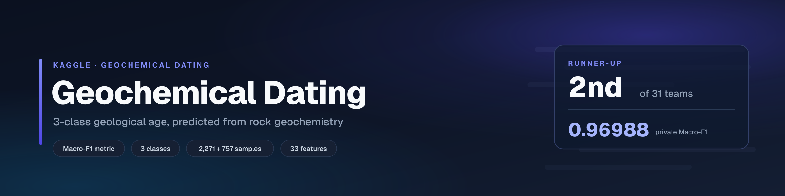
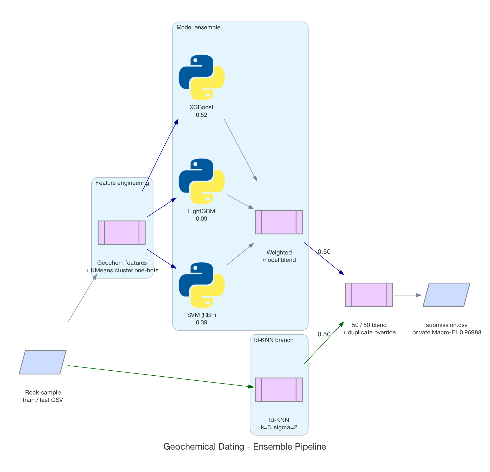
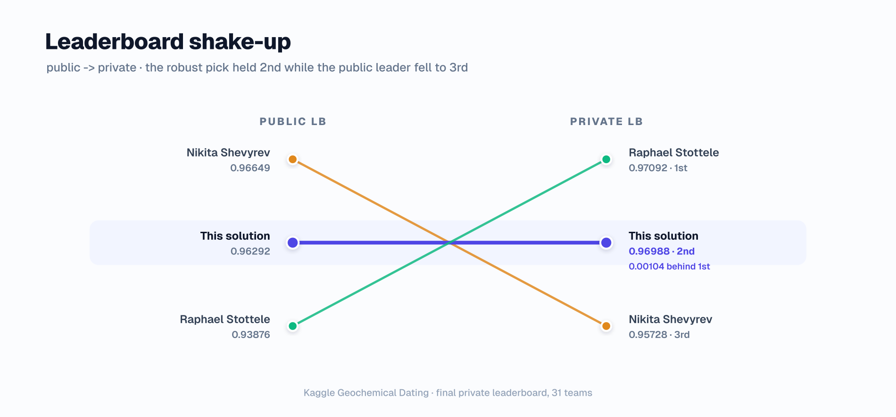

<div align="center">



<br><br>

[](https://github.com/damsolanke/geochemical-dating/actions/workflows/ci.yml)
[](LICENSE)
[](https://www.python.org)
[](https://www.kaggle.com/competitions/geochemical-dating/leaderboard)

Predicting the geological age class of igneous rock samples from their major-oxide and trace-element geochemistry —<br>a robust two-branch ensemble that generalised **upward** on the private split and finished **0.00104 behind 1st**.


</div>

---

<p align="center"></p>

---

## Result

> [!TIP]
> The final submission was chosen on **cross-validation, not public-leaderboard rank**. That bias toward generalisation paid off: it sat 2nd on the public board and rose to **0.96988** on the private split, while the public leader overfit and fell to 3rd.

<p align="center"></p>

| Competitor | Public LB | Private LB | Private rank |
|---|---|---|---|
| Raphael Stottele | 0.93876 | **0.97092** | **1st** |
| **This solution** | 0.96292 | **0.96988** | **2nd** |
| Nikita Shevyrev | 0.96649 | 0.95728 | 3rd |

The public-leaderboard leader (0.96649) dropped to 3rd on the private split (0.95728) — a textbook public→private shake-up — while this submission moved from 0.96292 to 0.96988. First place went to a low-public-profile entry (0.93876 public) whose pick generalised even better, finishing **0.00104** ahead. The takeaway cuts both ways: avoiding public-LB overfitting is necessary but not sufficient — the eventual winner was simply even less coupled to the public signal.

### Leak audit

The competition submission fed the raw `Id` column not only to the Id-KNN branch but also to the model ensemble as a plain feature, so the "geochemistry" branch also saw the dataset-ordering artifact. `src/pipeline.py` now keeps `Id` out of the ensemble by default and only re-adds it with `--id-in-ensemble`; every run writes `logs/metrics_<tag>.json` with the per-component OOF Macro-F1 (`ensemble_oof_macro_f1`, `blended_oof_macro_f1`, `idknn_oof_macro_f1`), the feature count and the `id_in_ensemble` flag, so the two variants can be compared from their metrics files alone.

| Run | Command | Ensemble OOF | Blended OOF | Private LB |
|---|---|---|---|---|
| Competition run (ensemble also saw `Id`) | `python src/pipeline.py --tag final --id-in-ensemble` | pending | pending | **0.96988** |
| Leak-free default | `python src/pipeline.py --tag leakfree` | pending | pending | not submitted |

The private-LB score is the only verified number in this table. The OOF cells are pending a re-run on the Kaggle data; they will be filled from `logs/metrics_final.json` and `logs/metrics_leakfree.json`, which `.gitignore` deliberately keeps trackable (`!logs/metrics_*.json`).

---

## Problem

| Field | Value |
|---|---|
| Task | 3-class classification — geological age of ultrabasic/igneous melt samples |
| Metric | Macro-F1 (all classes weighted equally; the ~17% minority class matters as much as the majority) |
| Features | 33 raw columns: major oxides, trace elements, chondrite-normalised REE, element ratios |
| Train / test | 2,271 / 757 rows |

## Approach

A 50/50 arithmetic blend of two components that capture orthogonal signal:

| Component | Weight | What it captures | Generalises? |
|---|---|---|---|
| **Id-KNN** — dataset-structure exploit (`src/idknn.py`) | 50% | The sample `Id` tracks the source database's row order (Spearman ≈ 0.999), so contiguous `Id` runs share an age class. Predicts each sample from the labels of its nearest neighbours in `Id` space (k=3, σ=2, exponential weighting; OOF via 10-fold). | **No** — specific to how this dataset was assembled; it would not survive a shuffled or blinded split. |
| **Model ensemble** — geochemistry (`src/pipeline.py`) | 50% | A weighted blend `0.52·XGBoost + 0.09·LightGBM + 0.39·SVM(RBF)` over engineered features plus KMeans cluster one-hots, with cluster-frequency sample weighting, 15-fold CV averaged over 5 seeds. In the competition run the feature list also included the raw `Id` (`--id-in-ensemble`); the default now excludes it — see [Leak audit](#leak-audit). | **Yes** with the leak-free default — a standard geochemical classifier. The competition-run variant also leaned on `Id`. |

Exact train/test duplicate rows are overridden with their known labels. Neither component is competitive alone — the Id-KNN encodes dataset structure, the ensemble encodes chemistry, and only their equal-weight blend reaches the top of the board. Tilting away from 50/50 reduced public Macro-F1, so the equal weight was kept as the most robust choice.

Engineered features (`src/features.py`) are domain-informed: Mg#, alumina-saturation proxy, LREE/HREE enrichment, Nb and Ce anomalies, Ti/Nb, REE slope, log-transformed trace elements, silica bins, and interaction terms.

---

## Quick Start

```bash
git clone https://github.com/damsolanke/geochemical-dating.git
cd geochemical-dating
pip install -r requirements.txt

# Place the competition data (from Kaggle) in data/ :
#   data/train.csv   data/test.csv
# The data is not redistributed with this repo — see "Data & attribution".

# Leak-free default: the model ensemble sees geochemistry only.
python src/pipeline.py --tag leakfree                 # -> submissions/submission_leakfree.csv + logs/metrics_leakfree.json

# Exact competition run: the ensemble also gets the raw Id column.
python src/pipeline.py --tag final --id-in-ensemble   # -> submissions/submission_final.csv + logs/metrics_final.json

ruff check src tests scripts   # lint
pytest -v                      # 12 tests; needs no Kaggle data (the smoke test builds a synthetic set)
```

`--n-folds`, `--seeds`, `--knn-folds` and `--n-rounds` shrink the run for a quick check; `--data-dir` / `--out-dir` relocate the inputs and outputs.

## Design Decisions

| Decision | Why | Tradeoff |
|---|---|---|
| 50/50 Id-KNN + model blend | The two signals (ordering vs chemistry) are orthogonal; an equal weight was the most robust out-of-sample | Tilting toward either component lowered public Macro-F1 |
| Select the least-overfit submission | Minimise public→private shake-up risk ("trust your CV") | Gave up a marginally higher public score for robustness — which beat the public leader on private |
| Cluster-frequency sample weighting | Focus the models on regions of feature space the test set actually occupies | Adds KMeans hyperparameters |
| SVM alongside the tree models | Decorrelated errors vs XGBoost/LightGBM | Slower than GBMs alone |
| Exact-duplicate override | Train/test exact matches are certain, free labels | Affects only a handful of rows |

## Project Structure

```
geochemical-dating/
├── src/
│   ├── __init__.py
│   ├── features.py               # domain geochemical feature engineering
│   ├── idknn.py                  # Id-based KNN — the 50% structural component
│   └── pipeline.py               # end-to-end: features -> blend -> submission + metrics JSON
├── tests/
│   ├── __init__.py
│   ├── test_features.py          # feature-engineering unit tests
│   ├── test_idknn.py             # Id-KNN unit tests
│   └── test_pipeline_smoke.py    # end-to-end run on a synthetic dataset
├── scripts/
│   ├── generate_diagrams.py      # renders docs/images/architecture.png
│   ├── generate_banner.py        # renders docs/images/banner.png
│   └── generate_results.py       # renders docs/images/shakeup.png
├── docs/images/
│   ├── architecture.png
│   ├── banner.png
│   └── shakeup.png
├── .github/workflows/ci.yml      # ruff + pytest on Python 3.10-3.12, gitleaks
├── requirements.txt              # pinned; installed from scratch on 3.10, 3.11 and 3.12
└── LICENSE
```

## Testing

```bash
ruff check src tests scripts   # lint — the same command CI runs
pytest -v                      # 12 tests, well under a minute on CPU, no Kaggle data or network needed
```

| File | What it checks |
|---|---|
| `tests/test_features.py` | Feature-engineering layer: column creation, no NaNs, value ranges, leakage-safe column selection. |
| `tests/test_idknn.py` | Id-KNN: normalised probabilities, the nearest `Id` run wins, exact-match weighting, effect of `k` / `sigma`. |
| `tests/test_pipeline_smoke.py` | The whole pipeline on a synthetic ~600/200-row dataset with the competition's column names (`--n-folds 2 --seeds 1 --knn-folds 2 --n-rounds 30`): `Id,Label` submission columns, metrics keys, duplicate-override count, and that `Id` reaches the ensemble only with `--id-in-ensemble`. |

CI (`.github/workflows/ci.yml`) runs the lint and the suite on Python 3.10, 3.11 and 3.12 on every push and pull request, plus a gitleaks secret scan of the full history.

---

## Data & Attribution

The competition data is **not** redistributed here (per Kaggle's data-sharing terms); only the solution code is. The competition dataset is a subset derived from a published geochemistry source:

- Lustrino, M., Salari, G., Rahimzadeh, B., Fedele, L., Masoudi, F., Agostini, S. (2022). *Iran and SE Anatolia Meso-Cenozoic igneous rock compositions.* GRO.data, V1.1. https://doi.org/10.25625/IZSZBL (CC BY 4.0).
- GEOROC Database — https://georoc.eu/ (CC BY-SA 4.0).

## Limitations

> [!NOTE]
> The Id-KNN component exploits a **structural artifact**: the sample `Id` tracks the source database's row order, so neighbours in `Id` space usually share an age class. That is specific to how this dataset was assembled and would not transfer to a properly shuffled or blinded split. In the competition run the model ensemble *also* received the raw `Id` as a feature, so it was not purely geochemical either; the pipeline now drops `Id` from the ensemble by default and `--id-in-ensemble` reproduces the competition run (see [Leak audit](#leak-audit)). The leak-free ensemble is the generalisable part; the blend is what won the competition.

- Small field (31 teams), and 1st place finished 0.00104 ahead — the margin at the top was roughly a single private-set sample.

## License

MIT — see [LICENSE](LICENSE).
